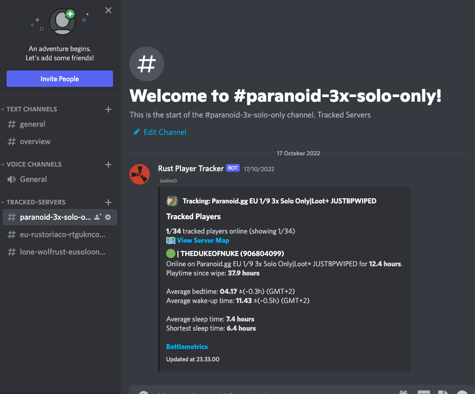

# Rust Player Tracker

A discord bot that tracks and analyses sleep schedules of Rust players for fun and profit.

Created with Node.js, Discord.js and Prisma ORM.

## Features

- Tracks player's online status
- Informs users via DM when a player connects / disconnects
- Tracks player's playtime since last wipe
- Attempts to guess player's bedtime and wake-up time based on collected session data
- Provides statistics such as how long a player has been online and how long is the player's average sleep time
- Creates and updates an overview channel for each server

## Commands

Because the bot uses Battlemetrics API to fetch the player information,
you will have to use server and player IDs from [Battlemetrics](https://www.battlemetrics.com/servers/rust/) with the commands.

You can easily find the IDs by looking at the URL of the server or player page.

### Servers

These are used to track and untrack servers.

- `/server add <SERVER BATTLEMETRICS ID>`
- `/server remove <SERVER BATTLEMETRICS ID>`

### Track and untrack players.

These can only be used in the overview channels. 

- `/player add <PLAYER BATTLEMETRICS ID>`
- `/player remove <PLAYER BATTLEMETRICS ID>/<PLAYER NAME>`
- `/player list`
  - List all tracked players in current server
- `/player info <PLAYER BATTLEMETRICS ID>/<PLAYER NAME>`
  - List and show information about player's past sessions

### Notifications

Manage your discord accounts DM notifications per tracked server.

- `/notifications enable`
- `/notifications disable`


## Screenshots



## Building

### .env

Create a `.env` file in the root directory and add the following variables:

```
BATTLEMETRICS_TOKEN=<BATTLEMETRICS API KEY HERE>
DISCORD_TOKEN=<DISCORD BOT TOKEN HERE>
```

[How to get discord bot token](https://discordjs.guide/preparations/setting-up-a-bot-application.html)

[How to add the bot to your server](https://discordjs.guide/preparations/adding-your-bot-to-servers.html)

[How to get battlemetrics api key](https://www.battlemetrics.com/developers)

After that, install dependencies by running `npm install`, initialize the database with `npx prisma db push` and start the bot with `npm start`.

## Contributing

Contributions are welcome! Please open an issue or a pull request.
